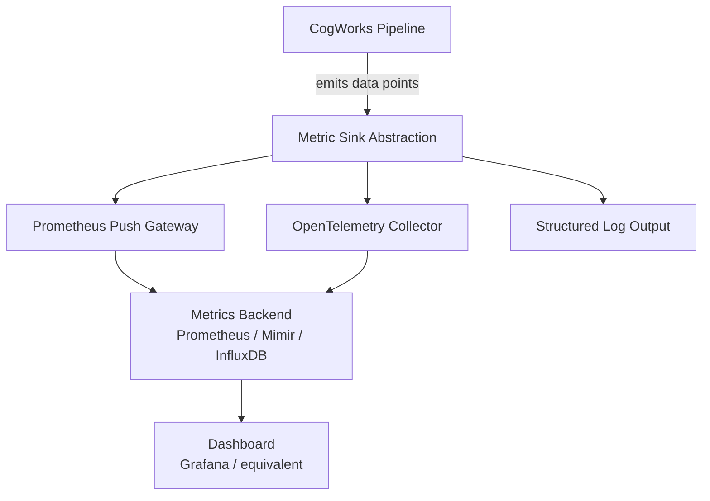

# Operations

This document covers deployment, monitoring, cost management, and operational runbook for CogWorks.

---

## Deployment Model

### CogWorks Binary + Domain Services

CogWorks ships as a single Rust binary. Domain services are separate processes — each may be a separate binary, a container, or a script. The Rust domain service may be distributed alongside CogWorks for convenience but runs as a separate process.

**Required runtime dependencies:**

- GitHub API access (token or GitHub App credentials)
- LLM API access (Anthropic API key)
- At least one registered domain service (running and reachable via configured transport)
- Network access (GitHub API, LLM API)

**Domain service dependencies (owned by each domain service, NOT by CogWorks):**

- Working copy management (git clone, checkout, etc.)
- Domain-specific toolchains (e.g., Rust toolchain for Rust domain service, KiCad for KiCad domain service)
- Domain-specific fixtures and test infrastructure

**No required infrastructure:**

- No database
- No message queue
- No cache server
- No container orchestration (for CLI mode)

### Environment Variables

| Variable | Required | Description |
|----------|----------|-------------|
| `COGWORKS_GITHUB_TOKEN` | Yes | GitHub API token (PAT or App installation token) |
| `COGWORKS_LLM_API_KEY` | Yes | Anthropic API key |
| `COGWORKS_LOG_LEVEL` | No | Log verbosity (default: `info`) |
| `COGWORKS_LOG_FORMAT` | No | Log format: `json` (default) or `text` (for local dev) |
| `COGWORKS_TEMP_DIR` | No | Base directory for temporary files (default: system temp) |
| `COGWORKS_DOMAIN_SERVICES_CONFIG` | No | Path to domain service registration config (default: `.cogworks/services.toml`) |

Domain service configuration is specified in a registration file (default `.cogworks/services.toml`) rather than environment variables, to support multiple services with varying transports. The config contains only connection information — capabilities, artifact types, interface types, and domain are discovered dynamically via the handshake protocol:

```toml
# .cogworks/services.toml

[[services]]
name = "rust"
transport = "unix"
path = "/tmp/cogworks-rust.sock"
# health_check_timeout_ms = 5000  # optional, default: 5000

[[services]]
name = "kicad"
transport = "http"
url = "http://localhost:9100"
# health_check_timeout_ms = 10000  # optional
```

On startup, CogWorks performs a handshake with each registered service to discover:

- `domain` (e.g., "firmware", "electrical")
- `capabilities` (which Extension API methods the service supports)
- `artifact_types` (which file extensions the service handles)
- `interface_types` (which cross-domain interface types the service can validate)
- `api_version` (for compatibility gating — services with an incompatible API version are rejected at startup and reported as unavailable)

### CLI Interface

```
cogworks process <issue-url>     # Process a single work item (one step)
cogworks process-all <repo>      # Scan repo for trigger labels, process each
cogworks status <issue-url>      # Display current pipeline state (read-only)
cogworks cost-report <issue-url> # Display cost report for a pipeline
cogworks health                  # Check health of all registered domain services
cogworks health <service-name>   # Check health of a specific domain service
```

### Future: Poll Mode

```
cogworks poll <repo> --interval 60   # Check every 60 seconds for work items
```

Wraps `process-all` in a timer loop. Same core logic.

### Future: Webhook Mode

```
cogworks serve --port 8080    # Listen for GitHub App webhook events
```

Wraps `process` in an HTTP handler. Each webhook event triggers one step function invocation.

---

## Monitoring and Observability

### Structured Logging

All log output is structured JSON. Every log entry includes:

```json
{
  "timestamp": "2026-02-16T14:30:00Z",
  "level": "info",
  "pipeline_id": 42,
  "node": "code_generation",
  "sub_work_item": 5,
  "action": "llm_call",
  "result": "success",
  "duration_ms": 3200,
  "tokens_input": 4500,
  "tokens_output": 1200,
  "message": "Generated code for sub-work-item #5"
}
```

### Key Metrics (for future service mode)

When running as a service, expose these metrics:

| Metric | Type | Description |
|--------|------|-------------|
| `cogworks_pipelines_active` | Gauge | Number of pipelines currently in progress |
| `cogworks_pipelines_completed_total` | Counter | Pipelines completed (by status: success/failed/escalated) |
| `cogworks_node_duration_seconds` | Histogram | Time spent in each node |
| `cogworks_llm_calls_total` | Counter | LLM API calls (by node, model, result) |
| `cogworks_llm_tokens_total` | Counter | Tokens consumed (by node, model, direction) |
| `cogworks_llm_cost_dollars` | Counter | Accumulated LLM cost |
| `cogworks_github_api_calls_total` | Counter | GitHub API calls (by endpoint, status) |
| `cogworks_github_rate_limit_remaining` | Gauge | Remaining GitHub API budget |
| `cogworks_retries_total` | Counter | Retry attempts (by node, reason) |
| `cogworks_escalations_total` | Counter | Escalations (by reason) |
| `cogworks_domain_service_calls_total` | Counter | Domain service calls (by service, method, result) |
| `cogworks_domain_service_latency_seconds` | Histogram | Domain service call latency (by service, method) |
| `cogworks_domain_service_health` | Gauge | Domain service health status (by service: 1=healthy, 0=unhealthy) |
| `cogworks_constraint_validation_total` | Counter | Constraint validation runs (by result: pass, warning, block) |
| `cogworks_injection_detected_total` | Counter | INJECTION_DETECTED events (should be zero in normal operation; alert if non-zero) |
| `cogworks_scope_violations_total` | Counter | Scope violation events (by type: underspecified, ambiguous, protected_path) |
| `cogworks_context_packs_loaded` | Gauge | Number of Context Packs loaded per pipeline run (by pipeline) |
| `cogworks_required_artefact_failures_total` | Counter | Required artefact blocking findings at Review node (by pack name) |
| `cogworks_hold_state_total` | Counter | Work items entering hold state (injection detection events) |
| `cogworks_constitutional_load_failures_total` | Counter | Constitutional rules load failures (should be zero; alert if non-zero) |
| `cogworks_parallel_nodes_active` | Gauge | Number of nodes currently executing in parallel within a pipeline |
| `cogworks_edge_evaluations_total` | Counter | Edge condition evaluations (by type: deterministic, llm, composite; by result: taken, not_taken) |
| `cogworks_rework_traversals_total` | Counter | Rework edge traversals (by cycle identifier) |
| `cogworks_pipeline_state_writes_total` | Counter | Pipeline state writes to GitHub (node boundary persistence events) |

For CLI mode, these are logged as structured events. For service mode, they are exposed as Prometheus metrics.

### Audit Trail on GitHub

Every pipeline run produces an audit trail posted as comments on the parent work item:

1. **Node entry comment**: When a node begins, post a summary of what will be done.
2. **Node completion comment**: When a node completes, post a summary of what was done (LLM calls made, validations passed, artifacts created).
3. **Failure comment**: When a node fails, post a structured failure report.
4. **Pipeline state comment**: Updated at each node boundary with the full pipeline state JSON (active/completed/pending/failed nodes, traversal counts, cumulative cost).
5. **Cost comment**: On pipeline completion (or failure), post a cost report.

---

## Cost Management

### Budget Configuration

```toml
# .cogworks/config.toml

[budgets]
pipeline_max_tokens = 500000        # Total tokens per pipeline
pipeline_max_cost_dollars = 10.00   # Total cost per pipeline
sub_work_item_max_retries = 5       # Retries per sub-work-item
review_max_remediation_cycles = 3   # Review→fix cycles per sub-work-item

[context_packs]
# Path to context packs directory (default: .cogworks/context-packs/)
directory = ".cogworks/context-packs/"

[constitutional]
# Path to constitutional rules file (default: .cogworks/constitutional-rules.md)
rules_file = ".cogworks/constitutional-rules.md"
# Protected path patterns: CogWorks NEVER generates files matching these patterns
# These defaults cannot be removed, only extended
protected_paths_extra = []  # Additional patterns beyond the built-in defaults
```

### Cost Tracking

Costs are tracked in-memory during a pipeline run and written to GitHub on completion:

```
Pipeline #42 Cost Report
========================
Node                     Tokens      Cost
─────────────────────────────────────────
1. Task Classification     2,300    $0.03
2. Architecture           15,000    $0.22
3. Interface Design        8,500    $0.12
4. Planning               12,000    $0.18
5. Code Generation
   SWI #1                 45,000    $0.67
   SWI #2                 38,000    $0.57
   SWI #3                 52,000    $0.78
6. Review
   SWI #1 (4 passes)      20,000    $0.30
   SWI #2 (4 passes)      18,000    $0.27
   SWI #3 (4 passes + 1 remediation)
                           27,000    $0.40
─────────────────────────────────────────
Total                    230,800    $3.44
Budget                   500,000   $10.00
Remaining                269,200    $6.56
```

### Cost Alerts

- **50% consumed**: Informational log entry.
- **75% consumed**: Warning log entry + comment on work item.
- **90% consumed**: Warning log entry + comment on work item with remaining budget.
- **100% consumed**: Pipeline halts. Failure report posted.

---

## Performance Metrics

### Metrics Architecture

CogWorks emits structured metric data points at pipeline boundaries for external consumption. CogWorks itself does not store, aggregate, or dashboard metrics — these concerns are delegated to purpose-built external tools.



When no external metric sink is configured, CogWorks logs data points to structured output. The pipeline operates identically whether or not a sink is configured — no metrics system is required for CogWorks to function.

### Metric Categories

CogWorks emits raw data points. The following categories define how external systems should organize and aggregate these data points.

#### Pipeline Effectiveness Metrics

| Metric | Emitted Data Points | External Aggregation |
|--------|---------------------|---------------------|
| First-pass success rate | Final disposition per pipeline run (merged, rejected, failed, abandoned) | Count merged-on-first-pass / total runs over period |
| Convergence rate | Retry count per code generation cycle | Percentage of runs that converge within retry budget over period |
| Human intervention rate | Whether human gate was triggered per run | Count interventions / total runs over period |
| Safety finding escape rate | Post-merge safety findings detected (if any) | Count escapes / total runs over period |

#### Pipeline Efficiency Metrics

| Metric | Emitted Data Points | External Aggregation |
|--------|---------------------|---------------------|
| Pipeline cycle time | Node start/end timestamps per run | Mean, p50, p95, p99 over period |
| Per-node latency | Wall-clock duration per node per run | Mean/percentile per node type |
| LLM cost per pipeline | Total token usage and cost per run | Mean, trend over period |
| Domain service latency | Per-method invocation timing per run | Mean/percentile per method |
| Retry overhead | Time and tokens spent on retries per run | Retry cost as percentage of total |

#### Pipeline Quality Metrics

| Metric | Emitted Data Points | External Aggregation |
|--------|---------------------|---------------------|
| Satisfaction score distribution | Per-scenario satisfaction score per run | Distribution, mean, trend |
| Review finding density | Count and severity of review findings per run | Mean per pipeline, trend |
| Remediation success rate | Whether remediation resolved finding per cycle | Success rate over period |
| Cross-domain violation rate | Cross-domain constraint violations per run | Count per run, trend |

#### Pipeline Learning Metrics

| Metric | Emitted Data Points | External Aggregation |
|--------|---------------------|---------------------|
| Failure root cause distribution | Structured root cause category per failure | Category distribution over period |
| Retry root cause concentration | Root cause category per retry | Most common retry causes over period |
| Context Pack effectiveness | Which packs loaded, pipeline outcome | Success rate per pack combination |
| Budget utilization | Actual cost vs budget per run | Utilization distribution |

### Review Cadence

External dashboards should be configured with views for three review cadences:

| Cadence | Focus | Recommended Actions |
|---------|-------|-------------------|
| Weekly | Operational health: failure rate, cycle time anomalies, cost spikes | Investigate failed runs, adjust retry budgets if needed |
| Monthly | Trend analysis: first-pass success trend, cost efficiency, common root causes | Update Context Packs for common failure patterns, adjust scenario thresholds |
| Quarterly | Strategic review: overall effectiveness, domain service performance, process improvement ROI | Revise pipeline configuration, invest in domain service improvements, update improvement backlog |

### Improvement Loop

When metrics indicate degradation in pipeline performance, the following diagnostic flow is recommended:

```
Measure → Detect → Diagnose → Improve → Verify
```

1. **Measure**: CogWorks emits structured metric data points continuously.
2. **Detect**: External monitoring detects threshold crossings or trend changes (configured in Grafana alerts, Prometheus alertmanager, etc.).
3. **Diagnose**: Use the diagnostic tables below to trace symptom → likely cause → improvement action.
4. **Improve**: Implement the improvement (Context Pack update, scenario addition, pipeline configuration change, domain service fix).
5. **Verify**: Monitor the metric data points for the next N pipeline runs to confirm improvement.

#### Common Diagnostic Patterns

| Symptom | Likely Cause | Improvement Action |
|---------|-------------|-------------------|
| First-pass success rate declining | Context drift (codebase evolves, Context Packs stale) | Update Context Packs with current patterns |
| Retry count increasing for specific node types | Domain service regression or new code patterns | Investigate domain service logs, add scenarios for new patterns |
| Cycle time increasing without retry increase | LLM latency regression or larger work items | Check LLM provider status, review work item decomposition |
| Satisfaction scores declining for specific scenarios | Scenarios becoming outdated or overly strict | Review and update scenario definitions, adjust thresholds |
| Cost per pipeline increasing steadily | Context growth (more files, more interfaces) | Review pyramid summary levels, consider context window optimization |
| High remediation failure rate | Systemic code quality issues not covered by scenarios | Add new scenarios or Context Pack guidance, investigate domain service feedback quality |
| Safety finding escapes detected post-merge | Insufficient scenario coverage for safety-critical paths | Add safety-focused scenarios, review constitutional rules, consider lowering human gate threshold |

### Improvement Backlog

Improvements identified through the review cadence process should be tracked as regular GitHub Issues tagged with the `process:improvement` label. This keeps improvement work visible alongside feature work and allows CogWorks pipeline runs to implement process improvements when appropriate.

### Metric Sink Configuration

The metric sink is configured in `.cogworks/config.toml`:

```toml
[metrics]
# No sink configured: metrics appear in structured log output only
# sink = "none"

# Prometheus Push Gateway
# sink = "prometheus"
# prometheus_gateway_url = "http://localhost:9091"
# prometheus_job = "cogworks"

# OpenTelemetry Collector
# sink = "otlp"
# otlp_endpoint = "http://localhost:4317"
# otlp_protocol = "grpc"  # or "http"
```

---

## Operational Runbook

### Domain Service Unavailable

**Symptom**: Pipeline fails with "domain service unreachable" or health check failure during pre-flight.

**Diagnosis**:

1. Run `cogworks health <service-name>` to check the specific domain service.
2. Verify the domain service process is running (`ps`, `systemctl status`, etc.).
3. Check the configured socket path or URL in `.cogworks/services.toml`.
4. Check domain service logs for crash or startup failure.

**Resolution**:

1. Restart the domain service process.
2. Verify the socket/port is not in use by another process.
3. If the service was never started, start it with the appropriate command for that domain.
4. Re-invoke: `cogworks process <issue-url>`.

---

### Domain Service Health Check Failure

**Symptom**: `cogworks health` returns unhealthy for a service, or pipeline logs show "version mismatch" or "missing capabilities".

**Diagnosis**:

1. Run `cogworks health <service-name>` — check reported version and capabilities.
2. Compare reported Extension API version against CogWorks' required version.
3. Check which capabilities the pipeline requires vs. what the service reports.

**Resolution**:

1. If version mismatch: update the domain service to a compatible Extension API version.
2. If missing capabilities: the domain service may not support all operations CogWorks needs. Either update the domain service or limit work items to operations it supports.
3. After updating, verify with `cogworks health <service-name>`.

---

### Interface Registry Validation Failure

**Symptom**: Pipeline fails during architecture or review node with "interface registry validation error".

**Diagnosis**:

1. Check the error message — it will identify the specific TOML file and issue (schema error, conflict, unknown domain).
2. Review the `.cogworks/interfaces/` directory.
3. Validate TOML syntax with a standalone TOML validator.

**Resolution**:

1. If schema error: fix the TOML file to match the interface definition schema.
2. If parameter conflict: resolve conflicting definitions across files for the same interface parameter.
3. If unknown domain: either register the missing domain service in `.cogworks/services.toml` or remove the interface definition referencing it.
4. Re-invoke: `cogworks process <issue-url>`.

---

### Pipeline is Stuck (Processing Lock)

**Symptom**: Work item has `cogworks:processing` label but no progress.

**Diagnosis**:

1. Check the timestamp comment associated with the processing label.
2. If > 30 minutes old, the previous invocation likely crashed.

**Resolution**:

1. Remove `cogworks:processing` label.
2. Re-invoke: `cogworks process <issue-url>`.
3. The system will read GitHub state and resume from the last completed step.

---

### Pipeline Failed

**Symptom**: Work item has `cogworks:node:failed` label.

**Diagnosis**:

1. Read the failure comment on the work item.
2. Check the node and specific error.

**Resolution by failure type**:

| Failure | Resolution |
|---------|-----------|
| Retry budget exceeded | Review the error summary. Modify the sub-work-item description or interfaces to be clearer. Re-trigger. |
| Cost budget exceeded | Increase budget in config if the work is legitimate. Consider breaking into smaller work items. |
| Scope threshold exceeded | Review the scope estimate. Confirm or reject by commenting and removing the failed label. |
| Configuration error | Fix `.cogworks/config.toml` and re-trigger. |
| GitHub API error | Check token permissions and rate limits. Re-trigger. |
| LLM API error | Check API key and provider status. Re-trigger. |

---

### Sub-Work-Item PR Rejected

**Symptom**: A sub-work-item PR was closed or changes requested.

**Resolution**:

1. Address review comments on the PR (or close it).
2. Apply `cogworks:status:pending` label to the sub-work-item issue.
3. Re-invoke: `cogworks process <parent-issue-url>`.
4. The system will detect the pending sub-work-item and re-generate code incorporating the review feedback.

---

### Rate Limit Exhaustion

**Symptom**: CogWorks logs show rate limit warnings or the CLI exits with a rate-limit error.

**Diagnosis**:

1. Check `X-RateLimit-Reset` time in the logs.
2. Determine if other tools are sharing the same token.

**Resolution**:

1. Wait for rate limit reset.
2. If recurring, use a dedicated GitHub App installation token for CogWorks.
3. Review pipeline for unnecessary API calls.

---

### LLM Cost Unexpectedly High

**Symptom**: Cost report shows high token usage.

**Diagnosis**:

1. Check per-node breakdown. Which node consumed the most tokens?
2. Check retry counts. High retries indicate the LLM is struggling with the task.
3. Check context sizes. Large context = more input tokens per call.

**Resolution**:

1. If retries are high: improve prompt templates, clarify interfaces/specifications.
2. If context is large: review what's being included. Consider more targeted context assembly.
3. If the work item is inherently complex: break it into smaller work items.
4. Consider using a cheaper model for high-retry nodes (code generation iterations).

---

### Scenario Validation Failures

**Symptom**: Sub-work-item fails scenario validation with satisfaction score below threshold.

**Diagnosis**:

1. Check the scenario validation results in the audit trail.
2. Identify which scenarios failed and which trajectories did not satisfy acceptance criteria.
3. Review the observed behaviors for failing trajectories.

**Resolution**:

1. If the same scenario fails consistently: the generated code has a genuine issue. Remediation will feed the failures back to the code generator.
2. If failures are sporadic (different trajectories fail on each run): non-deterministic behavior. Investigate the source (race condition, timing dependency, external state).
3. If all trajectories for all scenarios fail: likely an environment or Digital Twin issue, not a code issue. Check twin status and environment configuration.

---

### Digital Twin Issues

**Symptom**: Scenario validation fails with "twin failed to start" or similar error.

**Diagnosis**:

1. Check the twin provisioner logs.
2. Verify the twin binary exists at the configured path.
3. Check for port conflicts (twin may require specific ports).
4. Attempt to start the twin manually to see detailed error output.

**Resolution**:

1. If twin binary is missing: file a work item to build the twin using the twin specification.
2. If port conflict: identify and stop the conflicting process, or configure the twin to use a different port range.
3. If twin crashes on startup: review twin logs, fix the twin code, and rebuild.

---

### Pyramid Summary Cache Issues

**Symptom**: Warnings about stale summaries in logs, or unexpectedly large context allocations.

**Diagnosis**:

1. Check summary cache directory (`.cogworks/summaries/` by default).
2. Compare file modification times between source modules and cached summaries.
3. Check summary regeneration configuration (`regenerate_on` setting).

**Resolution**:

1. If many summaries are stale: trigger a batch regeneration (if `regenerate_on` is manual, run the summary generation job).
2. If summaries are missing entirely: summaries are optional. Context assembly will fall back to including full files or excluding them. Not an error, but reduces context efficiency.
3. If regeneration is taking too long: summaries are cached to avoid this. Check if the summary generation job is configured correctly and using an appropriate (cheap, fast) model.

---

### Injection Detected (Hold State)

**Symptom**: Work item has `cogworks:hold` label and audit trail shows `INJECTION_DETECTED` event.

**Diagnosis**:

1. Read the failure comment on the work item — it will include the source document and offending text.
2. Review the flagged content critically: is it a genuine injection attempt or a false positive?
3. Common false positives: security test pseudocode, examples of injection patterns in training documentation, or technical content that uses imperative language.

**Resolution**:

- **If genuine injection attempt**: Mark the work item as contaminated. Remove the `cogworks:run` label and add a comment documenting the contamination. Do not remove the `cogworks:hold` label. Notify the team about the injection attempt origin.
- **If false positive**: Remove the `cogworks:hold` label with a comment documenting why the flagged content is legitimate (e.g., "False positive — security test pseudocode, not an injection attempt"). Include the reviewer's name. Re-invoke: `cogworks process <issue-url>`.

**Alert recommendation**: Integrate `cogworks_injection_detected_total` metric with an alert. Any non-zero value warrants immediate review.

---

### Scope Underspecified or Ambiguous

**Symptom**: Pipeline fails with `SCOPE_UNDERSPECIFIED` or `SCOPE_AMBIGUOUS` event in audit trail.

**Diagnosis**:

1. Read the event details — it will identify the missing capability or ambiguous specification section.
2. `SCOPE_UNDERSPECIFIED`: The work item requires a capability not in the approved specification or interface document.
3. `SCOPE_AMBIGUOUS`: A safety-affecting specification section is ambiguous and cannot be implemented without clarification.

**Resolution**:

1. Review the specification and interface documents.
2. For `SCOPE_UNDERSPECIFIED`: Update the specification PR or interface document to explicitly include the needed capability.
3. For `SCOPE_AMBIGUOUS`: Clarify the ambiguous specification section by updating the spec PR with a more explicit definition.
4. After updating the specification, the Interface Design node may need to be re-run to update the interface document.
5. Re-invoke: `cogworks process <issue-url>`.

---

### Context Pack Not Loading

**Symptom**: LLM is generating code that ignores domain-specific safety patterns or best practices. Audit trail shows zero packs loaded for a work item that should match a pack.

**Diagnosis**:

1. Check the audit trail for pack loading events — it will list which packs were evaluated and why each did or did not match.
2. Check that `.cogworks/context-packs/` exists and contains the expected pack directory.
3. Check the pack's `trigger.toml` for the affected component tags or classification labels.
4. Verify the work item's classification output matches the expected tags/labels.

**Resolution**:

1. If the pack directory is missing: create it with the required pack structure.
2. If the trigger definition is wrong: update `trigger.toml` to match the correct classification output.
3. If the work item is being misclassified: check the classification node output and the safety-critical module registry.
4. After updating pack content, no CogWorks action needed — packs are loaded automatically on next pipeline run.

---

### Required Artefact Missing (Context Pack Enforcement)

**Symptom**: Review node fails with blocking finding referencing a Context Pack and a missing artefact.

**Diagnosis**:

1. Read the blocking finding — it identifies the pack name and the specific required artefact.
2. Check the output artifacts to understand what was generated and what the pack expected.
3. Common causes: the work item is in a domain with strict documentation requirements (embedded safety, ISO 9001) and the LLM didn't generate the required documentation section.

**Resolution**:

1. The blocking finding is fed back to the Code Generator automatically (standard remediation loop).
2. If the LLM cannot produce the required artefact within the retry budget: escalate. The missing artefact likely requires domain expert input.
3. If the required artefact declaration in the pack is incorrect: update the pack's `required-artefacts.toml` via a PR.

### Maintaining Scenarios

**Operation**: Adding or updating scenario specifications.

**Process**:

1. Scenario specifications are version-controlled in `.cogworks/scenarios/` (or configured directory).
2. Scenarios are authored and maintained by humans, not generated by CogWorks.
3. Each scenario file declares which modules/interfaces it covers.
4. After adding/updating scenarios, no CogWorks action is needed—scenarios are loaded automatically on next pipeline run for applicable sub-work-items.

**Best practices**:

- Keep scenarios focused (one behavior per scenario).
- Use deterministic assertions where possible (cheaper, faster, more reliable than LLM-as-judge).
- Document explicit failure criteria for safety-critical conditions (e.g., "motor never exceeds safe angle").
- Review scenario coverage periodically—ensure all critical interfaces are covered.

---

### Maintaining Digital Twins

**Operation**: Building, updating, or deprecating Digital Twins.

**Process**:

1. Twins are built and maintained via the standard CogWorks pipeline (file a work item with the twin specification).
2. Each twin includes a conformance test suite that validates behavior against the specification.
3. Periodically (recommended: weekly or on upstream service releases), run conformance tests against the real service to detect drift.
4. When drift is detected, file a work item to update the twin.

**Best practices**:

- Prioritize twins for high-volume or high-failure-risk dependencies (e.g., hardware simulators, rate-limited APIs).
- Document twin fidelity requirements clearly (which behaviors must match exactly, which can be simplified).
- Twins should be fast (support 100+ concurrent scenarios).
- Include failure injection profiles for common degraded-mode scenarios (timeout, malformed response, rate limit).

---

### Managing Tool Adapters

**Operation**: Generating, updating, and verifying adapter tool definitions from API specifications.

**Commands**:

- `cogworks adapter generate <spec-path> [--output-dir <dir>] [--namespace <name>]` — Generate tool definitions from an API specification (OpenAPI or EAB).
- `cogworks adapter drift <adapter-dir>` — Compare generated adapters against their source spec and report differences.
- `cogworks adapter regenerate <adapter-dir>` — Regenerate adapters from the stored source spec reference.
- `cogworks adapter list` — List all registered adapter sets with their source spec paths and last-generated timestamps.

**Process**:

1. Obtain the API specification (OpenAPI 3.0/3.1 JSON/YAML, or EAB JSON Schema).
2. Run `cogworks adapter generate` to produce tool definitions in `.cogworks/adapters/<name>/`.
3. Review the generated definitions and commit them to version control.
4. Add the generated tools to appropriate tool profiles in `.cogworks/pipeline.toml`.
5. Set up CI to run `cogworks adapter drift` to detect specification changes.

**Best practices**:

- Run drift detection in CI on every PR that touches API specification files.
- Regenerate adapters when the source specification changes, rather than manually editing generated files.
- Use meaningful namespace prefixes (e.g., `inventree.stock`, `ci.github`) to keep tool names organized.
- Review generated scope parameter defaults before deploying.

---

### Managing Skills

**Operation**: Reviewing, activating, deprecating, and monitoring crystallised skills.

**Commands**:

- `cogworks skill list [--lifecycle <state>]` — List skills, optionally filtered by lifecycle state.
- `cogworks skill inspect <skill-name>` — Show skill details: manifest, script, parameters, lifecycle state, success rate.
- `cogworks skill propose <audit-run-id>` — Extract candidate skills from a completed pipeline run's audit trail.
- `cogworks skill activate <skill-name>` — Transition a Reviewed skill to Active.
- `cogworks skill deprecate <skill-name> [--alternative <alt-name>]` — Mark a skill as deprecated.
- `cogworks skill retire <skill-name>` — Remove a skill from active use.
- `cogworks skill stats` — Show per-skill success/failure rates and invocation counts.

**Process**:

1. After successful pipeline runs, periodically run `cogworks skill propose` to identify repeating tool invocation patterns.
2. Review proposed skills: inspect the script, verify scope requirements, check parameter schemas.
3. Commit reviewed skills to `.cogworks/skills/` and run `cogworks skill activate`.
4. Monitor skill performance with `cogworks skill stats`.
5. Deprecate skills with declining success rates; retire skills that are no longer relevant.

**Best practices**:

- Review proposed skills carefully — they are extracted from audit data and should be validated for correctness.
- Set the success rate threshold appropriately for your domain (default: 90% over last 20 runs).
- Document skill purpose and expected use cases in the manifest description.
- When deprecating, always specify an alternative when one exists.

---

### Monitoring Tool Usage

**Operation**: Reviewing tool invocation patterns, scope violations, and skill performance across pipeline runs.

**Key metrics to monitor**:

- **Tool call volume**: Per-tool invocation counts across runs. Excessive calls to a single tool may indicate poor prompt instructions or unnecessary work.
- **Scope violation rate**: High violation rates indicate profile misconfiguration, overly broad LLM instructions, or potential prompt injection attempts.
- **Skill vs. raw tool ratio**: Higher skill usage indicates successful crystallisation of proven patterns. Low skill usage despite available skills may indicate poor skill discovery or relevance.
- **Progressive discovery hit rate**: When progressive discovery is active, track how often LLMs use `tools.search` vs. `tools.schema` vs. direct `tools.call`. This indicates whether the compact index provides sufficient information.

**Alerting recommendations**:

| Metric | Warning Threshold | Critical Threshold |
|--------|-------------------|-------------------|
| Scope violations per pipeline run | > 5 | > 15 |
| Skill success rate (any single skill) | < 90% | < 75% |
| Tool calls per node execution | > 50 | > 100 |
